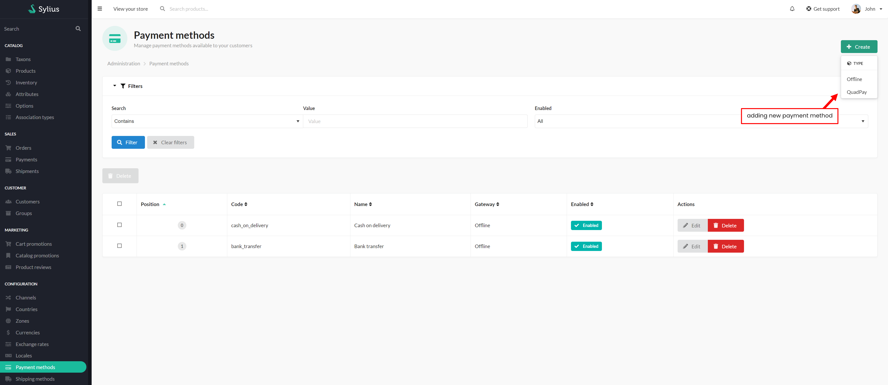
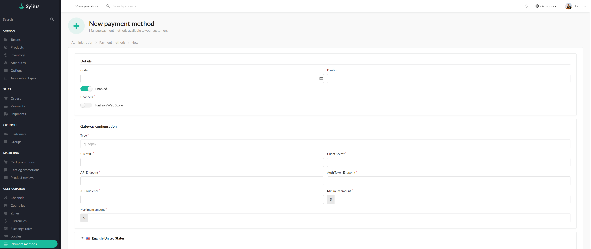
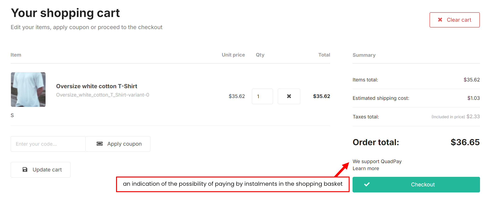
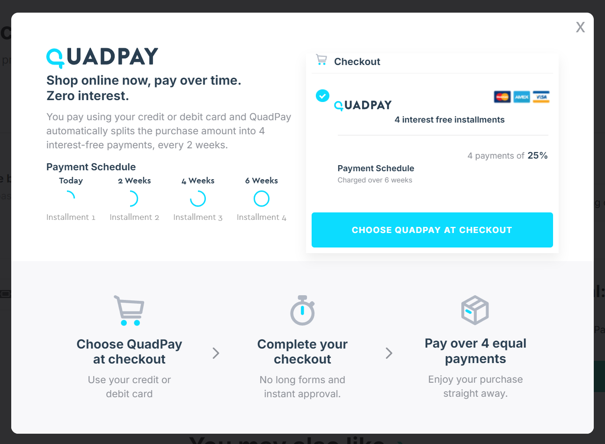

# Functionalities

---
## Introduction

---
QuadPay, Inc. is a US-based fintech company that offers a 'buy now, pay later' (BNPL - Buy Now, Pay Later) service.
It allows consumers to make purchases and spread their payments over four instalments, usually interest-free if payments are made on time.

This plugin supports communication with the QuadPay payment system API and **allows payments to be made in instalments**.

 

## Usage

---
### Adding Payment Gate

After installation, users can add the payment method

    

 

...by completing the data received from the service provider.

    

 

### Use of the gateway

When ordering, you can now choose to pay by QuadPay.

    

 

    

 
